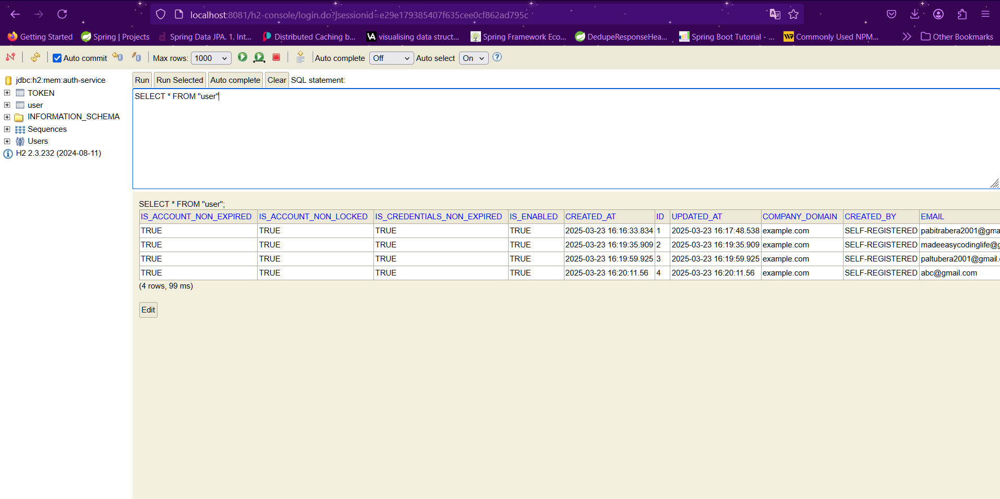

# 🛡️ Auth Service - Enterprise Expense Management System

A **Spring Boot Microservice** responsible for user authentication and authorization using **JWT**, integrated with **H2 Database** for persistence.

## 🚀 Features
✅ **User Registration & Authentication** (Sign-up, Sign-in, Logout)  
✅ **JWT-based Token Generation & Validation**  
✅ **Role-based Authorization** (Admin, Employee, Manager, Finance)  
✅ **Token Refresh Mechanism**  
✅ **Get User Details by Email**  
✅ **Partial User Updates**  
✅ **H2 Database with Web Console**  
✅ **Resilience with Circuit Breaker & Retry Mechanism**  
✅ **Service Discovery via Eureka**  
✅ **Global Swagger API Documentation**

---

## 📂 Folder Structure
```
auth-service/
│── src/main/java/com/madeeasy/
│── src/main/resources/
│   ├── application.yml
│── pom.xml
│── README.md
```

---

## 🔧 Setup & Configuration

### 1️⃣ Run the Service
```sh
mvn spring-boot:run
```

### 2️⃣ Access H2 Database
- **URL:** [http://localhost:8081/h2-console/](http://localhost:8081/h2-console/)
- **JDBC URL:** `jdbc:h2:mem:auth-service`
- **Username:** `sa`
- **Password:** `sa` (Defined in `application.yml`)



---

## 🛠️ API Endpoints

### 🔹 **User Authentication**

#### 🔹 Sign Up
```http
POST http://localhost:8081/auth-service/sign-up
```
#### Request Body
```json
{
  "fullName": "Pabitra Bera",
  "email": "pabitrabera2001@gmail.com",
  "password": "Apabitra@123",
  "phone": "8547965821",
  "role": "ADMIN"
}
```
#### Response
```json
{
  "accessToken": "eyJhbGciOiJIUzM4NCJ9...",
  "refreshToken": "eyJhbGciOiJIUzM4NCJ9..."
}
```

---

#### 🔹 Sign In
```http
POST http://localhost:8081/auth-service/sign-in
```
#### Request Body
```json
{
  "email": "abc@gmail.com",
  "password": "Apabitra@123"
}
```
#### Response
```json
{
  "accessToken": "eyJhbGciOiJIUzM4NCJ9...",
  "refreshToken": "eyJhbGciOiJIUzM4NCJ9..."
}
```

---

#### 🔹 Refresh Token
```http
POST http://localhost:8081/auth-service/refresh-token/{jwt-token}
```

```json
{
  "accessToken": "eyJhbGciOiJIUzM4NCJ9...",
  "refreshToken": "eyJhbGciOiJIUzM4NCJ9..."
}
```

---

### 🔹 **User Management**

#### 🔹 Get User Details (By Email)
```http
GET http://localhost:8081/auth-service/get-user/{emailId}
```
🔹 **Example:** `http://localhost:8081/auth-service/get-user/abc@gmail.com`

#### Headers
```http
Authorization: Bearer {accessToken}
```
#### Response
```json
{
  "id": 4,
  "fullName": "Ram Bera",
  "email": "abc@gmail.com",
  "companyDomain": "example.com",
  "phone": "1548745896",
  "role": "EMPLOYEE"
}
```

---

#### 🔹 Partial Update User
```http
PATCH http://localhost:8081/auth-service/partial-update/{userId}
```
#### Request Body (Example: Updating phone number)
```json
{
  "phone": "9876543210"
}
```

---

## 🔄 Resilience & Circuit Breaker
- Uses **Resilience4j** for **Circuit Breaker** & **Retry Mechanisms**
- Circuit breaker configuration ensures **automatic service recovery**
- Retry strategy implemented for handling **network failures & service unavailability**

---

## 📡 Service Discovery & API Documentation
- **Eureka Registration:** `http://localhost:8761/`
- **Swagger API Docs:** `http://localhost:8081/auth-service/v3/api-docs`

---

## 📬 Contributing
Feel free to fork, create a branch, and submit a PR! 🚀
