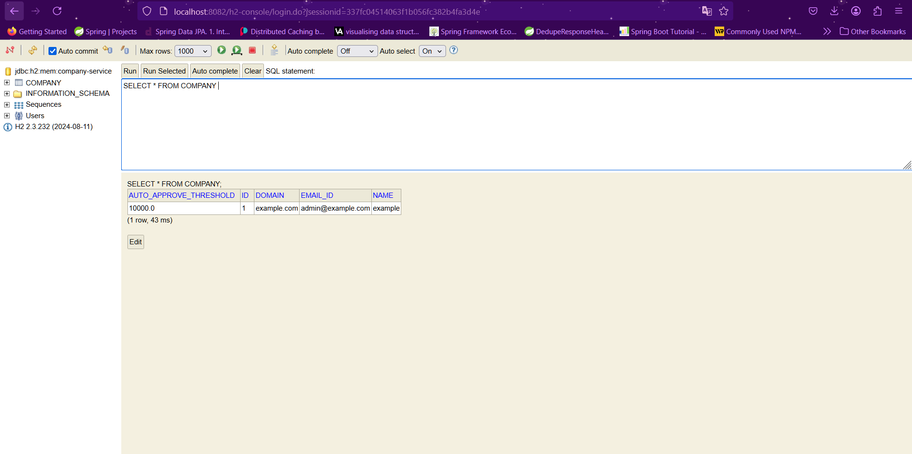
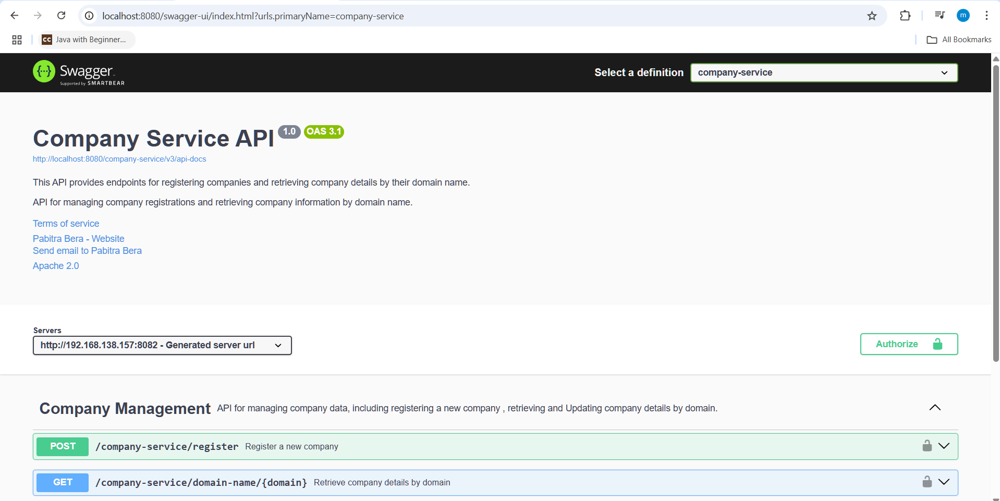

# 🏢 Company Service - Enterprise Expense System

## 🌟 Overview
The **Company Service** is a microservice responsible for managing company-related data within the **Enterprise Expense System**. It allows administrators to register companies, manage domains, and set expense auto-approval thresholds.

## 🛠️ Features
- **Company Registration** 📝
- **Domain-Based Company Identification** 🌐
- **Auto-Approval Threshold Configuration** ⚙️
- **Role-Based Access Control (RBAC)** 🔒
- **Service Discovery with Eureka** 🧭
- **Tracing with Zipkin** 🕵️‍♂️
- **Resilience with Circuit Breaker & Retry Mechanisms** 🔄
- **H2 Database for Development** 💾
- **API Documentation with SpringDoc** 📖

## ⚙️ Technologies Used
- **Spring Boot** (Microservices Framework) ⚡
- **Spring Security** (Authentication & Authorization) 🔐
- **Spring Cloud Eureka** (Service Discovery) 🏷️
- **Resilience4j** (Circuit Breaker & Retry) 🛡️
- **H2 Database** (In-memory DB for Dev) 🗄️
- **Spring Actuator** (Monitoring & Health Checks) 📊
- **SpringDoc & Swagger UI** (API Documentation) 🖥️

## 📡 API Endpoints

### Register a Company
**POST:** `http://localhost:8080/company-service/register`

**Headers:**  
`Authorization: Bearer <JWT_TOKEN>`

**Request Body:**
```json
{
    "name": "example",
    "domain": "example.com",
    "autoApproveThreshold": 6000
}
```

**Response:**
```json
{
    "id": 1,
    "name": "example",
    "domain": "example.com",
    "autoApproveThreshold": 6000
}
```

## 🗄️ Database Configuration
- **H2 Database** is used for in-memory storage in development mode.
- The H2 Console is enabled at: [H2 Database Console](http://localhost:8082/h2-console)



## 🚀 How to Run
1. Clone the repository
2. Configure environment variables if needed
3. Run the application:
   ```sh
   mvn spring-boot:run
   ```
4. Open Swagger UI at: [Swagger API Documentation](http://localhost:8080/swagger-ui/index.html?urls.primaryName=company-service)



## 📜 More Endpoints
To explore all available endpoints, refer to the project documentation or check the API definition in **SpringDoc**.

## 📬 Contributing
Feel free to fork the repo, create a branch, and submit a PR! 🚀
