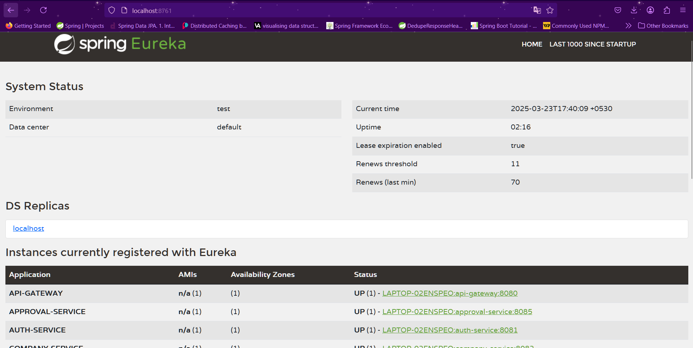
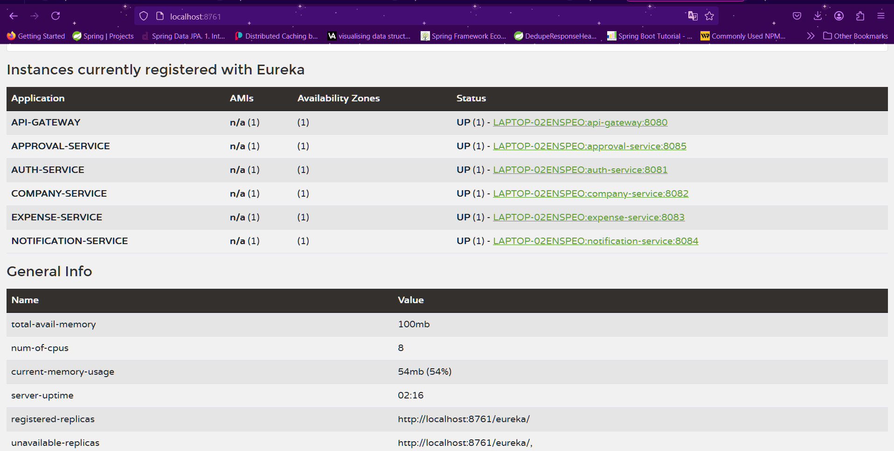

# 🧭 Eureka Server - Service Discovery

## 🌟 Overview
The **Eureka Server** is a crucial component of the **Enterprise Expense System**, enabling service discovery for microservices. It allows microservices to register themselves and discover other services dynamically.

## 🛠️ Features
- **Service Registration & Discovery** 📜
- **Self-Preservation Mode** 🛡️
- **Eureka Dashboard for Monitoring** 📊
- **Spring Boot & Spring Cloud Integration** ⚡
- **Zipkin Tracing Support** 🕵️‍♂️
- **Actuator Endpoints for Health Checks** 💡

## ⚙️ Technologies Used
- **Spring Boot** (Microservices Framework) ⚡
- **Spring Cloud Netflix Eureka** (Service Discovery) 🏷️
- **Spring Actuator** (Monitoring & Health Checks) 📊
- **Zipkin** (Distributed Tracing) 🔍

## 🚀 How to Run
1. Clone the repository
2. Configure environment variables if needed
3. Run the Eureka Server:
   ```sh
   mvn spring-boot:run
   ```
4. Access the Eureka Dashboard at: [Eureka Dashboard](http://localhost:8761)

## 📸 Eureka Dashboard



## 📡 API Endpoints

| Method | Endpoint            | Description                            |
|--------|---------------------|----------------------------------------|
| GET    | `/actuator/health`   | Check the health status of the server  |
| GET    | `/actuator/info`     | Retrieve service info                  |

## 📬 Contributing
Feel free to fork the repo, create a branch, and submit a PR! 🚀
