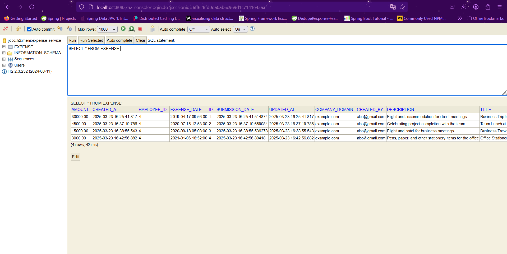
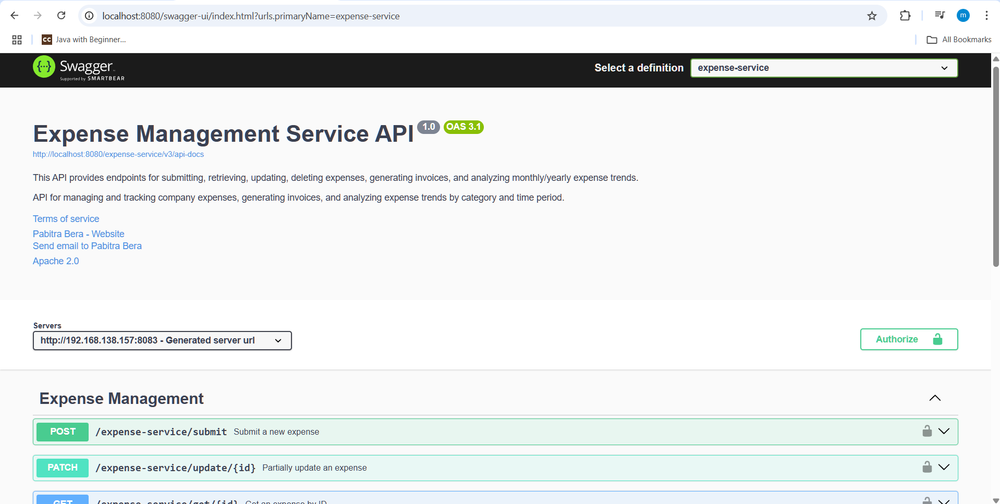
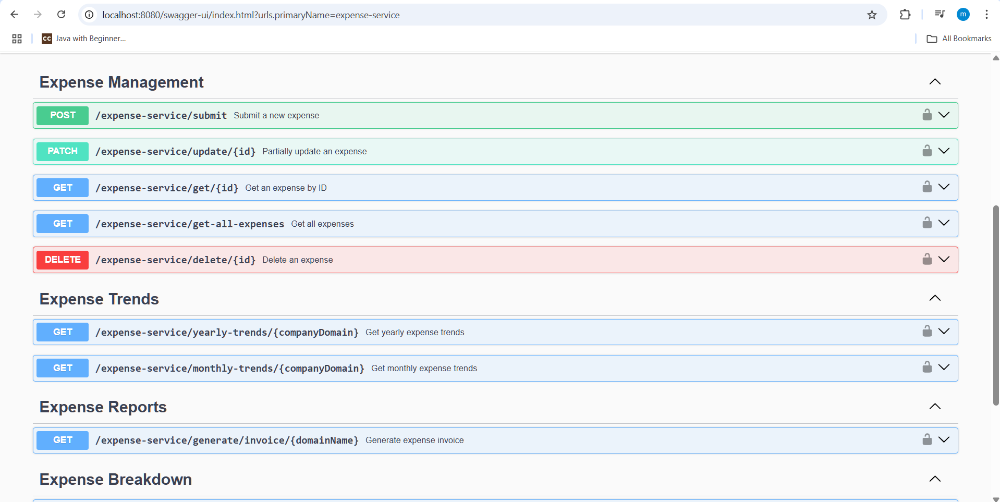

# 📌 Expense Service - Enterprise Expense System

## 🚀 Overview
The **Expense Service** is a microservice within the **Enterprise Expense System** responsible for handling expense submissions, tracking, and reporting. It allows employees to submit expenses while enabling admins, finance teams, and managers to analyze and monitor expense trends.

---

## 🎯 Features
✅ **Submit Expenses** 📝  
✅ **Role-Based Access Control (RBAC) 🔐**  
✅ **Expense Tracking & Categorization 📊**  
✅ **Resilience with Circuit Breaker & Retry Mechanisms 💡**  
✅ **Eureka Service Discovery 📡**  
✅ **Tracing with Zipkin 🕵️‍♂️**  
✅ **H2 Database for Development 🗄️**  
✅ **API Documentation with SpringDoc 📜**

---

## 🏗️ Technologies Used
- **Spring Boot** (Microservices Framework)
- **Spring Security** (Authentication & Authorization)
- **Spring Cloud Eureka** (Service Discovery)
- **Resilience4j** (Circuit Breaker & Retry)
- **H2 Database** (In-memory DB for Dev)
- **Spring Actuator** (Monitoring & Health Checks)
- **SpringDoc & Swagger UI** (API Documentation)
- **Zipkin** (Distributed Tracing)

---

## 🔥 API Endpoints

### ✨ Submit an Expense
**POST:**  `http://localhost:8083/expense-service/submit`

**Headers:**  
`Authorization: Bearer <JWT_TOKEN>`

**Request Body:**
```json
{
    "title": "Business Lunch",
    "description": "Lunch with client to discuss project progress",
    "amount": 6000.75,
    "category": "FOOD",
    "expenseDate": "2025-02-02T14:30:00"
}
```

---

### 📑 Generate Expense Invoice
**GET:**  `http://localhost:8083/expense-service/generate/invoice/{domainName}`  
Example: `http://localhost:8083/expense-service/generate/invoice/example.com`

**Headers:**  
`Authorization: Bearer <JWT_TOKEN>`

---

## 🖥️ H2 Database Console
The Expense Service uses an in-memory **H2 Database** during development. You can access the H2 Console at:  
🔗 **[http://localhost:8083/h2-console](http://localhost:8083/h2-console)**



---

## 📜 API Documentation
You can explore the API using **Swagger UI**:  
🔗 **[http://localhost:8083/swagger-ui/index.html?urls.primaryName=expense-service](http://localhost:8083/swagger-ui/index.html?urls.primaryName=expense-service)**





---

## 📜 More Endpoints

To explore all available endpoints, refer to the project documentation or check the API definition in **SpringDoc**.


## 📬 Contributing
Want to improve this service? Feel free to **fork** the repo, create a branch, and submit a PR! 🚀

